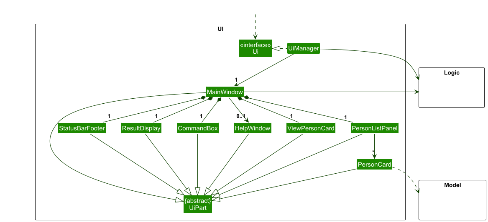
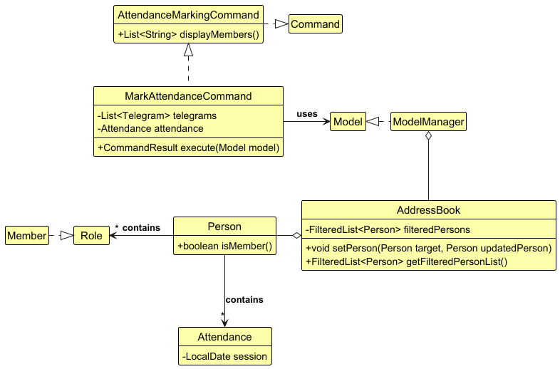
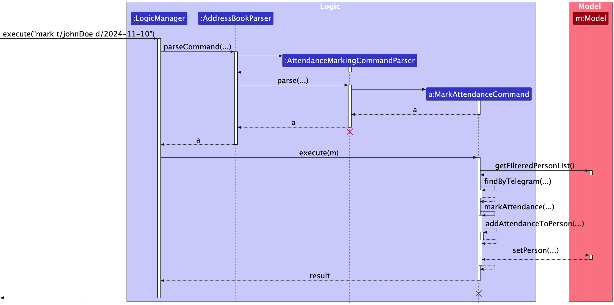
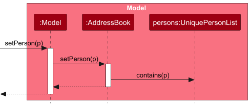
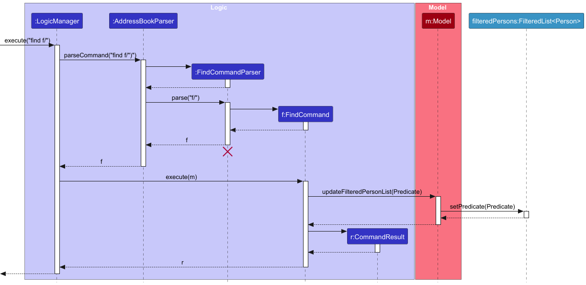

## Overview

CCAConnect is a desktop application that aims to **assist NUS CCA leaders** in **managing and collating relevant CCA personnel’s contact details**, as well as help to **track attendance details for CCA sessions**.
Equipped with features like **attendance marking**, **contact management**, **contact filtering** and **profile switching**, CCAConnect helps to reduce the headaches of personnel tracking.

--------------------------------------------------------------------------------------------------------------------

## Table of Contents
* Table of Contents
{:toc}

--------------------------------------------------------------------------------------------------------------------

## **Acknowledgements**

* This project is based on the AddressBook-Level3 project created by the [SE-EDU initiative](https://se-education.org).
* Libraries used: [JavaFX](https://openjfx.io/), [Jackson](https://github.com/FasterXML/jackson), [JUnit5](https://github.com/junit-team/junit5)

--------------------------------------------------------------------------------------------------------------------

## **Setting up, getting started**

Refer to the guide [_Setting up and getting started_](SettingUp.md).

--------------------------------------------------------------------------------------------------------------------

## **Design**

:bulb: **Tip:** The `.puml` files used to create diagrams in this document `docs/diagrams` folder. Refer to the [_PlantUML Tutorial_ at se-edu/guides](https://se-education.org/guides/tutorials/plantUml.html) to learn how to create and edit diagrams.

### Architecture

The ***Architecture Diagram*** given above explains the high-level design of the App.

Given below is a quick overview of main components and how they interact with each other.

**Main components of the architecture**

**`Main`** (consisting of classes [`Main`](https://github.com/se-edu/addressbook-level3/tree/master/src/main/java/seedu/address/Main.java) and [`MainApp`](https://github.com/se-edu/addressbook-level3/tree/master/src/main/java/seedu/address/MainApp.java)) is in charge of the app launch and shut down.
* At app launch, it initializes the other components in the correct sequence, and connects them up with each other.
* At shut down, it shuts down the other components and invokes cleanup methods where necessary.

The bulk of the app's work is done by the following four components:

* [**`UI`**](#ui-component): The UI of the App.
* [**`Logic`**](#logic-component): The command executor.
* [**`Model`**](#model-component): Holds the data of the App in memory.
* [**`Storage`**](#storage-component): Reads data from, and writes data to, the hard disk.

[**`Commons`**](#common-classes) represents a collection of classes used by multiple other components.

**How the architecture components interact with each other**

The *Sequence Diagram* below shows how the components interact with each other for the scenario where the user issues the command `delete 1`.

Each of the four main components (also shown in the diagram above),

* defines its *API* in an `interface` with the same name as the Component.
* implements its functionality using a concrete `{Component Name}Manager` class (which follows the corresponding API `interface` mentioned in the previous point.

For example, the `Logic` component defines its API in the `Logic.java` interface and implements its functionality using the `LogicManager.java` class which follows the `Logic` interface. Other components interact with a given component through its interface rather than the concrete class (reason: to prevent outside component's being coupled to the implementation of a component), as illustrated in the (partial) class diagram below.

The sections below give more details of each component.

### UI component

The **API** of this component is specified in [`Ui.java`](https://github.com/se-edu/addressbook-level3/tree/master/src/main/java/seedu/address/ui/Ui.java)

The UI consists of a `MainWindow` that is made up of parts e.g.`CommandBox`, `ResultDisplay`, `PersonListPanel`, `StatusBarFooter`, `HelpWindow` & `ViewPersonCard`. All these, including the `MainWindow`, inherit from the abstract `UiPart` class which captures the commonalities between classes that represent parts of the visible GUI.

The `UI` component uses the JavaFx UI framework. The layout of these UI parts are defined in matching `.fxml` files that are in the `src/main/resources/view` folder. For example, the layout of the [`MainWindow`](https://github.com/se-edu/addressbook-level3/tree/master/src/main/java/seedu/address/ui/MainWindow.java) is specified in [`MainWindow.fxml`](https://github.com/se-edu/addressbook-level3/tree/master/src/main/resources/view/MainWindow.fxml)

The `UI` component,

* executes user commands using the `Logic` component.
* listens for changes to `Model` data so that the UI can be updated with the modified data.
* keeps a reference to the `Logic` component, because the `UI` relies on the `Logic` to execute commands.
* depends on some classes in the `Model` component, as it displays `Person` object residing in the `Model`.

### Logic component

**API** : [`Logic.java`](https://github.com/se-edu/addressbook-level3/tree/master/src/main/java/seedu/address/logic/Logic.java)

Here's a (partial) class diagram of the `Logic` component:

The sequence diagram below illustrates the interactions within the `Logic` component, taking `execute("delete 1")` API call as an example.

:information_source: **Note:** The lifeline for `DeleteCommandParser` should end at the destroy marker (X) but due to a limitation of PlantUML, the lifeline continues till the end of diagram.

How the `Logic` component works:

1. When `Logic` is called upon to execute a command, it is passed to an `AddressBookParser` object which in turn creates a parser that matches the command (e.g., `DeleteCommandParser`) and uses it to parse the command.
1. This results in a `Command` object (more precisely, an object of one of its subclasses e.g., `DeleteCommand`) which is executed by the `LogicManager`.
1. The command can communicate with the `Model` when it is executed (e.g. to delete a person). 
   Note that although this is shown as a single step in the diagram above (for simplicity), in the code it can take several interactions (between the command object and the `Model`) to achieve.
1. The result of the command execution is encapsulated as a `CommandResult` object which is returned back from `Logic`.

Here are the other classes in `Logic` (omitted from the class diagram above) that are used for parsing a user command:

How the parsing works:
* When called upon to parse a user command, the `AddressBookParser` class creates an `XYZCommandParser` (`XYZ` is a placeholder for the specific command name e.g., `AddCommandParser`) which uses the other classes shown above to parse the user command and create a `XYZCommand` object (e.g., `AddCommand`) which the `AddressBookParser` returns back as a `Command` object.
* All `XYZCommandParser` classes (e.g., `AddCommandParser`, `DeleteCommandParser`, ...) inherit from the `Parser` interface so that they can be treated similarly where possible e.g, during testing.

### Model component
**API** : [`Model.java`](https://github.com/se-edu/addressbook-level3/tree/master/src/main/java/seedu/address/model/Model.java)

The `Model` component,

* stores the address book data i.e., all `Person` objects (which are contained in a `UniquePersonList` object).
* stores the currently 'selected' `Person` objects (e.g., results of a search query) as a separate `FilteredList<Person>`.
* wraps the _filtered_ list in a `SortedList<Person>`, where sorting order is determined by a `Comparator<Person>`, selected by the user.
* exposes `SortedList<Person>` to outsiders as an unmodifiable `ObservableList<Person>` that can be 'observed' e.g. the UI can be bound to this list so that the UI automatically updates when the data in the list change.
* stores a `UserPref` object that represents the user’s preferences. This is exposed to the outside as a `ReadOnlyUserPref` objects.
* does not depend on any of the other three components (as the `Model` represents data entities of the domain, they should make sense on their own without depending on other components)

### Storage component

**API** : [`Storage.java`](https://github.com/se-edu/addressbook-level3/tree/master/src/main/java/seedu/address/storage/Storage.java)

The `Storage` component,
* can save both address book data and user preference data in JSON format, and read them back into corresponding objects.
* inherits from both `AddressBookStorage` and `UserPrefStorage`, which means it can be treated as either one (if only the functionality of only one is needed).
* depends on some classes in the `Model` component (because the `Storage` component's job is to save/retrieve objects that belong to the `Model`)

### Common classes

Classes used by multiple components are in the `seedu.address.commons` package.

--------------------------------------------------------------------------------------------------------------------

## **Implementation**

This section describes some noteworthy details on how certain features are implemented.

### Sort feature
The sort command is reliant on the `SortOrder` enumeration. Each constant in `SortOrder` contains 2 additional values: the `keyword`, and the `stringRep` (which is the string representation of the order).
The command itself is encapsulated by the `SortCommand` class, which extends the abstract class `Command`, overriding its execution method.
On execution, the `SortCommand#execute()` method calls the `updateSortedPersonListComparator` method of the `model`, and passes in the relevant comparator, depending on which order the user selects.

### Mark/Unmark feature

#### Implementation

This command's implementation is based on the new field `attendance` of `Person` object which stores the list of attendances
if the person is a member.

Given below is the class diagram of `MarkAttendanceCommand` and relative classes it uses to execute.

**Find Targeted Member**

The command will call `Model::getFilteredPersonList` to get current contacts in addressbook,
then it filters the list by user input telegram handles, get a list of people by there telegrams to mark their attendance.

**Update Member Attendance**

The command will create a new `Person` object according to the `Person` referred by each of the input telegram handle,
add `attendance` to it, check if it is a member,
and call `Model::setPerson` to update the specified person in the `addressbook` of the `model`.

The following activity diagram summarizes what happens when a user executes a mark command:

The following sequence diagram shows how a mark operation goes through the `Logic` component:

:information_source: **Note:** The lifeline for `MarkAttendanceCommand` should end at the destroy marker (X) but due to a limitation of PlantUML, the lifeline reaches the end of diagram.

The `unmark` command does the opposite with the similar flow between `Logic` and `Model` component.

The following activity diagram summarizes what happens when a user executes a new command:

### Find feature

#### Implementation

The `find` command relies on the various `Predicate` classes, each of which encapsulates specific criteria to determine whether a contact matches the search conditions. These `Predicate` classes enable flexible and modular search logic, allowing the `find` command to filter contacts based on attributes such as `Name`, `Telegram`, `Role`, `FavouriteStatus`.

The following sequence diagram shows how a `find f/` command goes through both `Logic` component and interacts with `Model`

### Switch Profile Feature

The `switch` command allows users to manage separate profiles within the application, each storing independent data in an isolated session. This feature enables users to work on different datasets without interference, as if each profile represented a unique instance of the application.

#### Implementation

The `switch` command relies on the `Model` component to manage active and inactive profiles. Each profile’s data is stored separately, and they are accessible through the application’s working directory.

When a profile switch is initiated:
1. **Current Profile Update:** The `Model` adds the current profile to the inactive profiles list.
2. **Profile Data Swap:** The new profile is set as the active profile, and the `preferences.json` file is updated to reflect this change.
3. **Persistence Management:** `LogicManager` ensures the data is persisted to the hard disk upon valid command execution or application exit.

> **Note for Developers:** When testing in Gradle, avoid using the stop button, as it may bypass the standard data-saving mechanism. Use the GUI to exit to ensure data integrity.

#### Testing

Consider these test cases for `switch` command validation:
1. **Basic Profile Switching:** Verify that profiles are swapped correctly and data is isolated per profile.
2. **Data Persistence on Exit:** Confirm that profile changes are saved on application exit.
3. **Error Handling:** Test the different error messages that should appear based on the program's state:
   - **Single Profile Scenario:** If no other profiles are available to be swapped (i.e., only one profile exists), the application should display a help message to guide the user.
   - **Multiple Profiles Scenario:** If multiple profiles are available, the application should list the available profiles, showing the options that can be switched to.

--------------------------------------------------------------------------------------------------------------------

## **Documentation, logging, testing, configuration, dev-ops**

* [Documentation guide](Documentation.md)
* [Testing guide](Testing.md)
* [Logging guide](Logging.md)
* [Configuration guide](Configuration.md)
* [DevOps guide](DevOps.md)

--------------------------------------------------------------------------------------------------------------------

## **Appendix: Requirements**

### Product scope

**Target user profile**:

* CCA leaders in NUS
* has a need to manage a significant number of contacts related to CCA day-to-day operations and upkeep
* needs to additionally track details like roles, names, emails, etc.
* prefer desktop apps over other types
* can type fast
* prefers typing to mouse interactions
* is reasonably comfortable using CLI apps

**Value proposition**: The program aims to assist CCA leaders in NUS in managing and collating relevant CCA personnel’s contact details.
This is done via a clean user interface with a focus on the CLI, with fast access to the contact information of relevant CCA personnel,
providing users a one-stop solution to help manage CCA manpower related considerations.

### User stories
Priorities: High (must have) - `* * *`, Medium (nice to have) - `* *`, Low (unlikely to have) - `*`

| Priority | As a …        | I want to …                                                                 | So that I can…                                                          |
|----------|---------------|-----------------------------------------------------------------------------|-------------------------------------------------------------------------|
| `* * *`  | user          | add multiple contacts with one command                                      | add in multiple contacts at one time                                    |
| `* * *`  | user          | view all the information of a particular contact                            | focus on that one sole contact without distractions from other contacts |
| `* * *`  | user          | search for a contact by querying the saved name                             | get the information of the contact when needed                          |
| `* * *`  | user          | easily view the available commands on the app                               | quickly find the usage for a command I had forgotten                    |
| `* * *`  | user          | quickly duplicate a contact's information                                   | add similar contacts without re-entering details                        |
| `* * *`  | user          | add new contacts with the fewest possible keystrokes                        | add new contacts quickly                                                |
| `* * *`  | user          | add individual contacts                                                     | save the information of the contact and retrieve it when I want it      |
| `* * *`  | user          | edit the contact information of any entry                                   | update any outdated information, and keep the list current              |
| `* * *`  | user          | delete an entry if needed                                                   | remove any individuals who are no longer relevant to my organisation    |
| `* *`    | user          | sort the contacts by alphabetical order of their names                      | quickly scan through and find the relevant contact                      |
| `* *`    | user          | role contacts to a group/role name                                          | group individuals into relevant sections for better clarity             |
| `* *`    | user          | search for multiple contacts by querying its role                           | get the information of all the contacts related to the relevant role    |
| `* *`    | user          | save my current profile                                                     | persist my profile locally through different sessions                   |
| `* *`    | user          | export my profile                                                           | use my profile on other machines/by other people                        |
| `* *`    | user          | import another profile onto my local program                                | access the contact details from another user/another machine            |
| `* *`    | user          | add notes to any contact                                                    | remember important details about them                                   |
| `* *`    | user          | import my contacts from an external file                                    | quickly add contacts obtained from Google Forms or others               |
| `* *`    | user          | export my contacts to an external file                                      | send the contacts to another user or filter externally                  |
| `* *`    | user          | see all members in a separate view                                          | check members and mark their attendance more easily                     |
| `* *`    | user          | mark attendance of several members on specific date                         | accurately record their participation status in CCA activities          |
| `* *`    | user          | remove mark of attendance of several members on specific date               | accurately record their participation status in CCA activities          |
| `*`      | user          | start a temporary session that does not persist between sessions            | experiment with and play around with the environment                    |
| `*`      | user          | sort the contacts by popularity (how often I query the contact)             | quickly access frequently queried contacts                              |
| `*`      | user          | switch profiles to another profile, containing a separate list of contacts  | separate contacts of individuals in different organisations             |
| `*`      | seasoned user | leverage compound and nested queries/commands                               | get the exact results that I require, in fewer commands                 |
| `*`      | user          | customise commands to manage the contacts                                   | add, remove, modify, search contacts with greater efficiency            |
| `*`      | user          | secure my account with authentication                                       | only authorised users can access the information                        |
| `*`      | user          | back up my contacts regularly                                               | not lose important contact information                                  |
| `*`      | user          | log activity history with each contact                                      | keep track of my latest interactions and follow-ups                     |
| `*`      | user          | perform advanced searches using multiple criteria (e.g. role, last contact) | find specific contacts more efficiently                                 |
| `*`      | user          | customise the appearance of my address book (e.g. colour schemes, themes…)  | match my preferences                                                    |
| `*`      | user          | mark certain contacts as favourites                                         | easily find and access frequently used contacts                         |
| `*`      | user          | colour-code my contacts based on categories                                 | visually distinguish between different types of contacts                |
| `*`      | user          | set up quick actions (e.g. call, message…)                                  | reach out with a single click                                           |
| `*`      | user          | set privacy levels for each contact's information                           | protect sensitive details                                               |
| `*`      | user          | see a profile picture for each contact                                      | recall the person from the picture                                      |

### Use cases

**Notes**: _For all use cases below, the **System** is  `CCAConnect` and the **Actor** is the `user`, unless specified otherwise_
 

**Use Case: UC01 - View John Doe’s Contact Information** 
**Actor: User** 
**MSS**

1. User enters appropriate ‘view’ command to search for ‘John Doe’s contact information.
2. System opens up new page with John Doe’s contact information.

Use Case ends.

**Extensions**

* 1a. CCAConnect detects an error in the entered command information.
  * 1a1. CCAConnect returns an error message.
  * Steps 1a1 repeats till the user enters a valid and existing telegram handle for the command.
  * Use case resumes from step 2.

 

**Use Case: UC02 - Delete a contact** 
**Actor: User** 
**MSS**

1. User requests to list all contacts.
2. CCAConnect shows a list of contacts.
3. User requests to delete a specific contact at the list index.
4. CCAConnect deletes the contact.

Use Case ends.

**Extensions**

* 2a. The list is empty.
  * Use Case ends.

* 3a. User inputs an invalid index.
  * 3a1. CCAConnect shows an error message.
  * Use Case resumes at step 2.

 

**Use Case: UC03 - Add a contact** 
**Actor: User** 
**MSS**

1. User requests to add a contact.
2. User provides the details of the contact, including fields like name, phone number, etc.
3. System adds the contact to the list of contacts and displays the contact as a new entry in the list of contacts viewable by the user.

Use Case ends.

**Extensions**
* 3a. System detects that user did not enter all the required fields.
    * 3a1. System shows user an error message.
    * Use Case ends.

* 3b. System detects that user entered an invalid field.
    * 3b1. System shows user an appropriate error message.
    * Use Case ends.

 

**Use Case: UC04 - Search for a contact** 
**Actor: User** 
**MSS**

1. User searches the list of contacts with a query relating to a contact’s name.
2. System displays the subset of contacts with the same name as the query

Use Case ends.

**Extensions**
* 1a. User requests for a search, with no query.
    * 1a1. System displays an error to the user.
    * Use Case ends.

* 2a. System fails to find any contacts related to the query.
    * 2a1. System displays an empty list to the user.
    * Use Case ends.

 

**Use Case: UC05 - List all contacts** 
**Actor: User** 
**MSS**

User enters ‘list’ command to view information of all contacts.
System opens up a new page with all contact information currently stored in data storage of CCAConnect.

Use Case ends.

**Extensions**

* 1a. CCAConnect detects an error in the entered command information.
  * 1a1. CCAConnect returns an error message.
  * Steps 1a1 is repeated till the user enters a valid list command.
  * Use Case resumes from step 2.

 

**Use Case: UC06 - View all commands** 
**Actor: User** 
**MSS**

1. User requests to see all the available commands.
2. CCAConnect displays all valid commands.

Use Case ends.

 

**Use Case: UC07 - View all members** 
**Actor: User** 
**MSS**

1. User requests to see all members in the contacts.
2. CCAConnect displays all members.

Use Case ends.
 

 

**Use Case: UC08 - Mark attendance of members** 
**Actor: User** 
**MSS**

1. User requests to mark the attendance of members.
2. User provides the details of the session (date) to mark attendance, and list of telegrams of members to be marked.
3. System marks the attendance of the list of members on the specified date.

Use Case ends.

**Extensions**
* 1a. System detects that user did not enter all the required fields.
    * 1a1. System shows user an error message.
    * Use Case ends.

* 1b. System detects that user entered an invalid field.
    * 1b1. System shows user an appropriate error message.
    * Use Case ends.

* 1c. System detects that user tried to mark the attendance of non-member contact.
    * 1c1. System shows user an appropriate error message.
    * Use Case ends.
 

 

**Use Case: UC09 - Unmark attendance of members** 
**Actor: User** 
**MSS**

1. User requests to unmark the attendance of members.
2. User provides the details of the session (date) to unmark attendance, and list of telegrams of members to be unmarked.
3. System unmarks the attendance of the list of members on the specified date.

Use Case ends.

**Extensions**
* 1a. System detects that user did not enter all the required fields.
    * 1a1. System shows user an error message.
    * Use Case ends.

* 1b. System detects that user entered an invalid field.
    * 1b1. System shows user an appropriate error message.
    * Use Case ends.

* 1c. System detects that user tried to unmark the attendance of non-member contact.
    * 1c1. System shows user an appropriate error message.
    * Use Case ends.
___

### Non-Functional Requirements

1. The system should work on any mainstream OS as long as it has Java `17` or above installed. This primarily applies for windows, macos and linux
2. The system should be able to hold up to 1000 persons without a noticeable sluggishness in performance for typical usage.
3. A user with above average typing speed for regular English text (i.e. not code, not system admin commands) should be able to accomplish most of the tasks faster using commands than using the mouse.
4. Should not be bloated in application size
5. All functionality should be well documented, with example usages
6. The system must ensure that all contact information is stored accurately, and able to be retrieved without any loss of information or data corruption
7. The system should be able to respond to user inputs within 2 seconds, under normal load conditions
8. The program must include automated tests for all of its functionalities to ensure code reliability
9. All code changes must be tracked with a Revision Control Software
10. All code changes must be subject to peer review and approval by two separate team members (not including the owner of the change)
11. All releases must have proper documentation

### Glossary

* **Mainstream OS**: Windows, Linux, Unix, MacOS
* **Contact**: A contact comprises of a name, a phone number, an email, a telegram username and a role, represented as `Person` in the model
* **CLI**: Command Line Interface. This represents the interface where the user uses commands to communicate with the system
* **GUI**: Graphical User Interface. This represents the graphical interface that the user can interact with
* **User**: The individual using the app
* **System**: The CCAConnect application
* **Flag**: A specifier to indicate the start of an argument after a command. E.g. `n/` represents a name flag
* **Regex**: A regular expression, which is a sequence of characters that specifies a match pattern
* **Member**: A member is a special type of contact that has the role `Member` in its `roles`
___

## **Appendix: Instructions for manual testing**

Given below are instructions to test the app manually.

:information_source: **Note:** These instructions only provide a starting point for testers to work on;
testers are expected to do more *exploratory* testing.

### Add Feature

**Description**: Adds a new contact to the list of contacts.

**Test Case 1**:
1. Launch the application.
2. Enter `add n/tester p/99999999 e/test@test.com t/test123 r/member`

**Expected Result**:
- The new contact is added to the list and displayed.

**Test Case 2**:
1. Repeat steps 1 & 2 from *Test Case 1*.
2. Enter invalid data (e.g., empty name, invalid email / phone number / telegram handle).

**Expected Result**:
- Relevant error message is displayed, indicating what the invalid input is, and guiding the user to enter the right input.

### Edit Feature

**Description**: Edits an existing item in the list.

**Test Case 1**:
1. Identify the index of the contact you want to edit, `X`.
2. Enter `edit X n/New Name`

**Expected Result**:
- Contact at index `X` has a new contact name, `New Name`.

### Mark Feature

**Description**: Marks a (Member) contact as having attended a session.

**Test Case 1**:
1. Identify the telegram handle of the Member you wish to mark attendance for (e.g., `test123`).
2. Enter `mark t/test123 d/YYYY-MM-DD`, where YYYY-MM-DD is today's date in the specified format.

**Expected Result**:
- Contact is marked as having attended today's session, visually indicated with a checkmark in a box.

### Unmark Feature

**Description**: Unmarks a (Member) contact as having attended a session.

**Test Case 1**:
1. Identify the telegram handle of the Member you wish to mark attendance for (e.g., `test123`).
2. Enter `unmark t/test123 d/YYYY-MM-DD`, where YYYY-MM-DD is today's date in the specified format.

**Expected Result**:
- Contact is marked as having attended today's session, visually indicated with an empty box.

### Delete Feature

**Description**: Deletes a contact from the list.

**Test Case 1**:
1. Identify the index of the contact you want to edit, `X`.
2. Enter `delete X`.

**Expected Result**:
- Contact at index `X` is removed from the list.

### Sort Feature

**Description**: Sorts the items in the list based on a specified criterion (`asc`, `desc` or `og`).

**Test Case 1**:
1. Enter `sort asc`

**Expected Result**:
- The items in the list are sorted in ascending order (based on name).

**Test Case 2**:
1. Enter `sort tallest`

**Expected Result**:
- Error message `Sort order parameter can only be asc or desc or og.` displayed.

### Find Feature

**Description**: Finds items in the list that match a specified search query.

**Test Case 1**:
1. Identify criterion you wish to find contacts with (e.g., `r/member`)
2. Enter `find r/member`

**Expected Result**:
- Only contacts that have `Member` in their role are displayed.

### View Feature

**Description**: Views the details of a selected item.

**Test Case 1**:
1. Identify the telegram handle of the contact you wish to view (e.g., `test123`).
2. Enter `view t/test123`

**Expected Result**:
- The contact details of the specified contact are displayed.

**Test Case 2**:
1. Identify invalid telegram handle you wish to view (e.g., `test` (less than 5 characters) or `test!23` (contains invalid character))).
2. Enter `view t/test` or `view t/test!23`

**Expected Result**:
- Error message specifying exact error in telegram input displayed.

### General Testing Notes
- Ensure to test each feature with both valid and invalid inputs.
- Check for proper handling of edge cases, such as extremely large or small input values.
- Verify that the UI updates correctly and reflects the changes made by each feature.
- Confirm that error messages and prompts are displayed appropriately for invalid operations.
