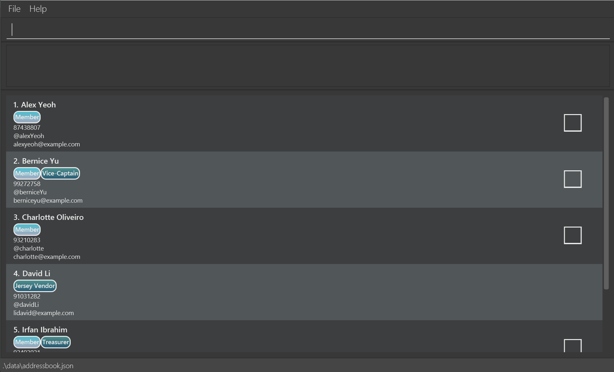
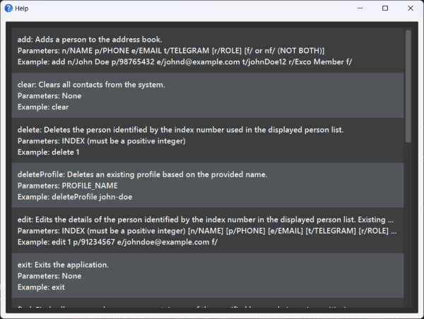
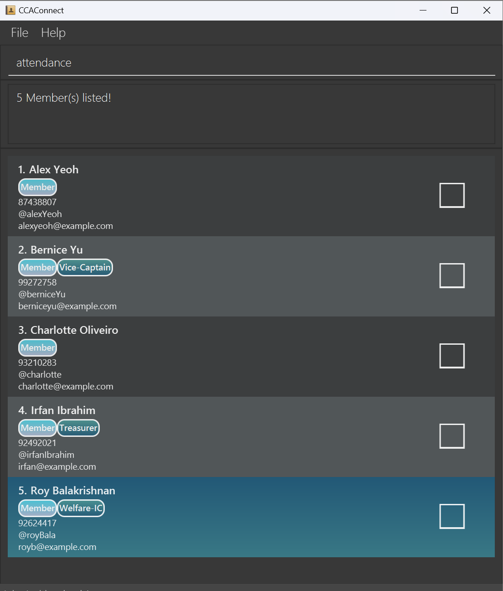

AddressBook Level 3 (AB3) is a **desktop app for managing contacts, optimized for use via a Command Line Interface** (CLI) while still having the benefits of a Graphical User Interface (GUI). If you can type fast, AB3 can get your contact management tasks done faster than traditional GUI apps.

* Table of Contents
{:toc}

--------------------------------------------------------------------------------------------------------------------

## Quick start

1. Ensure you have Java `17` or above installed in your Computer.

1. Download the latest `.jar` file from [here](https://github.com/se-edu/addressbook-level3/releases).

1. Copy the file to the folder you want to use as the _home folder_ for your AddressBook.

1. Open a command terminal, `cd` into the folder you put the jar file in, and use the `java -jar addressbook.jar` command to run the application. 
   A GUI similar to the below should appear in a few seconds. Note how the app contains some sample data. 
   

1. Type the command in the command box and press Enter to execute it. e.g. typing **`help`** and pressing Enter will open the help window. 
   Some example commands you can try:

   * `list` : Lists all contacts.

   * `add n/John Doe p/98765432 e/johnd@example.com a/John street, block 123, #01-01` : Adds a contact named `John Doe` to the Address Book.

   * `delete 3` : Deletes the 3rd contact shown in the current list.

   * `clear` : Deletes all contacts.

   * `exit` : Exits the app.

1. Refer to the [Features](#features) below for details of each command.

--------------------------------------------------------------------------------------------------------------------

## Features

**:information_source: Notes about the command format:** 

* Words in `UPPER_CASE` are the parameters to be supplied by the user. 
  e.g. in `add n/NAME`, `NAME` is a parameter which can be used as `add n/John Doe`.

* Items in square brackets are optional. 
  e.g `n/NAME [t/TAG]` can be used as `n/John Doe t/friend` or as `n/John Doe`.

* Items with `…`​ after them can be used multiple times including zero times. 
  e.g. `[r/ROLE]…​` can be used as ` ` (i.e. 0 times), `r/exco`, `r/member r/exco` etc.

* Parameters can be in any order. 
  e.g. if the command specifies `n/NAME p/PHONE_NUMBER`, `p/PHONE_NUMBER n/NAME` is also acceptable.

* The parameter prefixes (e.g. `n/`) with leading spaces are considered restricted keywords, and may not be present within existing parameters. However, for some parameters, using it within the parameter without a leading space (e.g. `n/a` within `ROLE`) is allowed

* If you are using a PDF version of this document, be careful when copying and pasting commands that span multiple lines as space characters surrounding line-breaks may be omitted when copied over to the application.

### Viewing help : `help`

Opens a new window that displays a list of all available commands along with their usage instructions.

Format: `help`

### Adding a person: `add`

Adds a person to the address book.

Format: `add n/NAME p/PHONE_NUMBER e/EMAIL t/TELEGRAM [r/ROLE]…​ [f/]`

Alias: `a` can be used in place of `add`

Parameters:
- `NAME`: should contain non-numeric characters and spaces, and should not be blank
- `PHONE_NUMBER`: should be a valid Singapore phone number (i.e. have 8 digits and start with 3, 6, 8, or 9)
- `EMAIL`: should be a valid email address (follow the restrictions provided in the error message)
- `TELEGRAM`: should be alphanumeric characters, and be between 5-32 characters long
- `ROLE`: should be between 1-20 characters long, if it exists
- `f/`: this indicates if the contact should be a favourite contact

:bulb: **Tip:**
A person can have any number of roles (including 0)

Examples:
* `add n/John Doe p/98765432 e/johnd@example.com t/johnDoe12`
* `a n/Betsy Crowe r/chairperson e/betsycrowe@example.com t/betsyC p/81234567 r/member f/`

### Listing all persons : `list`

Shows a list of all persons in the address book.

Format: `list`

### Editing a person : `edit`

Edits an existing person in the address book.

Format: `edit INDEX [n/NAME] [p/PHONE] [e/EMAIL] [a/ADDRESS] [t/TAG]…​`

* Edits the person at the specified `INDEX`. The index refers to the index number shown in the displayed person list. The index **must be a positive integer** 1, 2, 3, …​
* At least one of the optional fields must be provided.
* Existing values will be updated to the input values.
* When editing roles, the existing roles of the person will be removed i.e adding of roles is not cumulative.
* You can remove all the person’s roles by typing `t/` without
    specifying any roles after it.

Examples:
*  `edit 1 p/91234567 e/johndoe@example.com` Edits the phone number and email address of the 1st person to be `91234567` and `johndoe@example.com` respectively.
*  `edit 2 n/Betsy Crower t/` Edits the name of the 2nd person to be `Betsy Crower` and clears all existing roles.

### Locating persons: `find`

Search for contact(s) whose contact details satisfy either of the following:
1. Name contains any of the given name keyword(s)
2. Has a role stated by any of the role keyword(s)
3. Telegram handle which matches exactly with any of the given telegram keyword(s)
4. Is a favourite contact

Format: `find [n/name1] [r/role1] [t/telegram1] [f/] ... [MORE KEYWORDS WITH ITS PREFIX]`

#### By name: `find [n/name] ...`

Search for contact(s) whose name contain any of the given keywords.

* The search is case-insensitive. e.g `hans` will match `Hans`.
* The order of the keywords matters. e.g. `Hans Bo` will not match `Bo Hans`.
* The keyword(s) provided does not have to be a full word. e.g. `melia` will match `Amelia`.
* The keyword(s) provided can span across multiple words. e.g. `melia dan` will match `Amelia Danger`
* Persons matching at least one keyword will be returned (i.e. `OR` search).
  e.g. `aniel` will return `Daniel`, `Anielle`.

Example:
* `find n/john` returns `John Doe`, `John`, `Bob Johnson` 
  

#### By role: `find [r/role] ...`

Search for contact(s) who has a role that matches any of the role keywords.

* The search is case-insensitive. e.g `member` will match `MEMBER`.
* Contacts matching at least one keyword will be returned (i.e. `OR` search).
  e.g. `John` is both an `exco` and `member`, `find r/member` returns `John`.

Example:
* `find r/exco` returns `Michael` who has the role `exco` 
  

#### By telegram: `find [t/telegram] ...`

Search for contact(s) who has a telegram handle that matches exactly with any of the telegram keywords.

* The search is case-insensitive. e.g `david` will match `DAVID`.
* Contacts will need to match the telegram keywords exactly (case-insensitive) to be searched successfully.

Example:
* `find t/eveadams` returns `Eve Adams` who has a telegram handle `eveadams` 
  

#### By favourite: `find f/`

Search for favourite contact(s).

Example:
* `find f/` returns all 4 favourite contacts 
  

Composing all 4 types of search will give an `OR` search, a contact that has at least one matching criteria will be returned.

### Deleting a person : `delete`

Deletes the specified person from the address book.

Format: `delete INDEX` or `d INDEX`
- Deletes the person at the specified `INDEX`.

Valid `INDEX` Requirements:
- The index must refer to the index number shown in the displayed person list.
- The index **must be a positive integer** 1, 2, 3, …

Examples:
* `list` followed by `delete 2` deletes the 2nd person in the address book.
* `find n/alex` followed by `delete 1` deletes the 1st person in the results of the `find` command.

### Listing all members for attendance : `attendance`

Lists all contacts that have the role “Member” in the address book, making it easier to check and mark attendance for them directly.

Format: `attendance` or `atd` (alias)

* The command must be in lowercase. Variations (e.g., capitalized or mixed-case) will not be recognized.
* This command does not take any additional parameters. If any extra input is provided, an error message will be displayed.

### Marking attendance : `mark`

Marks attendance for **members** with specified Telegram handles on a specific date.

Format: `mark t/TELEGRAM1 [t/TELEGRAM2] [...] d/DATE`

Alternative Format: `m t/TELEGRAM1 [t/TELEGRAM2] [...] d/DATE`

* Each Telegram handle must begin with t/, followed by an alphanumeric or _ string with no spaces, e.g., t/berniceyu123.
* The command is not case-sensitive (e.g., t/alexyeoh is the same as t/ALEXYEOH) except command keyword `mark` itself.
* The command does not allow spaces between the prefix t/ or d/ and the argument.

Command Parameters:
- Telegram Handles (`t/telegram`):
  * Accepts multiple handles separated by spaces, each beginning with t/.
  * Handles must be alphanumeric or include _ (e.g., t/alex_yeoh123).
  * Invalid input: Spaces within or after the prefix (e.g., t/ alexyeoh) result in an error.
  * Telegram handle should belong to a contact with `Member` role.

- Date (`d/date`)
  * Takes in one string value with format d/YYYY-MM-DD (eg. d/2024-01-22 not d/2024/1/22)
  * Only accept one date, if multiple dates are input, only the last one will be recorded as the attendance date.
  * Date must not be later than current date (eg. 2090-11-02 is an invalid datetime)

Examples:

* `mark t/toom t/maary d/2024-11-02`

  

* Mark attendance of contact with telegram `toom` first, then input command `mark t/toom t/maary d/2024-11-02`

    

* Mark attendance of a non-member contact `mark t/jerry d/2024-11-02`

  

### Unmarking attendance : `unmark`

Unmarks attendance for **members** with specified Telegram handles on a specific date.

Format: `unmark t/TELEGRAM1 [t/TELEGRAM2] [...] d/DATE`

Alternative Format: `um t/TELEGRAM1 [t/TELEGRAM2] [...] d/DATE` 

* All parameter constraints and error messages are the same as `mark` command, except `mark` is replaced by `unmark`

### Clearing all entries : `clear`

Clears all entries from the address book.

Format: `clear`

### Exiting the program : `exit`

Exits the program.

Format: `exit`

### Switching a profile : `switch`
The `switch` command allows you to change the current session to a specified profile.
- If a valid profile name is provided, the session will switch to that profile.
  - If the profile already exists, it will switch to the existing profile.
  - If the profile does not exist, a new profile with that name will be created.

- If no profile name is provided (empty input) and multiple profiles exist, the command will display a list of
available profiles to switch to.
- Attempting to switch to the currently active profile will not perform a switch.

Format: `switch PROFILE` or `sw PROFILE`
  - `switch` or its alias `sw` switches the session to the profile specified by `PROFILE`.

Valid `PROFILE` Requirements: 
  - Must be between 1 and 30 characters.
  - Can only contain letters (a-z, A-Z), numbers (0-9), hyphens (-), and underscores (_).
  - `Profile` names are **case-insensitive** and treated as lowercase.
    - For example, `ALICE` and `alice` are considered the same profile.

Examples:
  - `switch john-doe` switches to a profile named 'john-doe'
  - `sw ALICE` switches to a profile named 'alice'
  - `switch` lists all available profiles that you can switch to, if they exist.

### Deleting a profile: `deleteProfile`

The `deleteProfile` command removes an existing profile from the system.
  
Format: `deleteProfile PROFILE` or `delp PROFILE`
- `deleteProfile` or its alias `delp` deletes the specified `PROFILE` 

Valid `PROFILE` Requirements:
- Must meet all requirements from the [`switch`](#switching-a-profile--switch) command.
- Must be an existing profile
- Must not be the currently active profile

Examples:
- Assuming your current profile is 'addressbook' then 
    - `deleteProfile addressbook` is not allowed because 'addressbook' is the active profile.
    - `sw alice` switches the current profile to 'alice'
    - `delp addressbook` deletes the 'addressbook' profile after switching to 'alice'

### Saving the data

AddressBook data are saved in the hard disk automatically after any command that changes the data. There is no need to save manually.

### Editing the data file

AddressBook data are saved automatically as a JSON file `[JAR file location]/data/addressbook.json`. Advanced users are welcome to update data directly by editing that data file.

:exclamation: **Caution:**
If your changes to the data file makes its format invalid, AddressBook will discard all data and start with an empty data file at the next run. Hence, it is recommended to take a backup of the file before editing it. 
Furthermore, certain edits can cause the AddressBook to behave in unexpected ways (e.g., if a value entered is outside of the acceptable range). Therefore, edit the data file only if you are confident that you can update it correctly.

### Archiving data files `[coming in v2.0]`

_Details coming soon ..._

--------------------------------------------------------------------------------------------------------------------

## FAQ

**Q**: How do I transfer my data to another Computer? 
**A**: Install the app in the other computer and overwrite the empty data file it creates with the file that contains the data of your previous AddressBook home folder.

--------------------------------------------------------------------------------------------------------------------

## Known issues

1. **When using multiple screens**, if you move the application to a secondary screen, and later switch to using only the primary screen, the GUI will open off-screen. The remedy is to delete the `preferences.json` file created by the application before running the application again.
2. **If you minimize the Help Window** and then run the `help` command (or use the `Help` menu, or the keyboard shortcut `F1`) again, the original Help Window will remain minimized, and no new Help Window will appear. The remedy is to manually restore the minimized Help Window.

--------------------------------------------------------------------------------------------------------------------

## Command summary

Action | Format, Examples
--------|------------------
**Add** | `add n/NAME p/PHONE_NUMBER e/EMAIL a/ADDRESS [t/TAG]…​`   e.g., `add n/James Ho p/22224444 e/jamesho@example.com a/123, Clementi Rd, 1234665 t/friend t/colleague`
**Clear** | `clear`
**Delete** | `delete INDEX`  e.g., `delete 3`
**Delete Profile** | `deleteProfile PROFILE`   e.g. `deleteProfile alice`
**Edit** | `edit INDEX [n/NAME] [p/PHONE_NUMBER] [e/EMAIL] [a/ADDRESS] [t/TAG]…​`  e.g.,`edit 2 n/James Lee e/jameslee@example.com`
**Find** | `find KEYWORD [MORE_KEYWORDS]`  e.g., `find James Jake`
**Switch** | `switch PROFILE`   e.g. `switch alice`
**List** | `list`
**Help** | `help`
**Attendance** | `attendance` or `atd`
**Mark Attendance** | `mark t/TELEGRAM1 [t/TELEGRAM2] [...] d/DATE` or `m t/TELEGRAM1 [t/TELEGRAM2] [...] d/DATE`   e.g., `mark t/berniceYu t/alexYeoh d/2024-11-02`
**Unmark Attendance** | `unmark t/TELEGRAM1 [t/TELEGRAM2] [...] d/DATE` or `um t/TELEGRAM1 [t/TELEGRAM2] [...] d/DATE`
